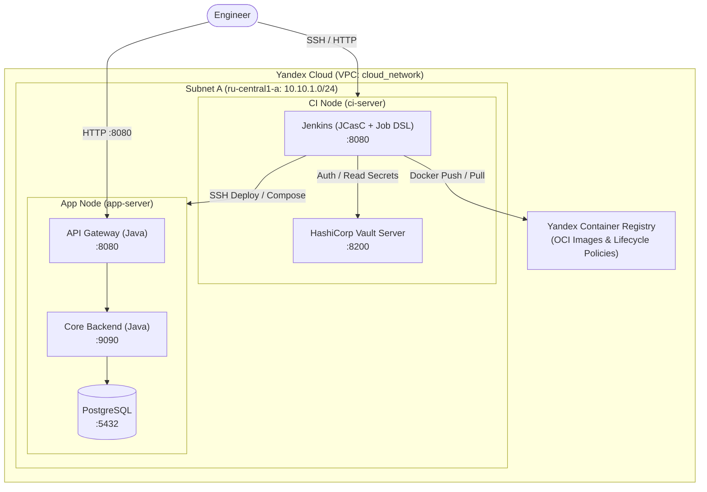
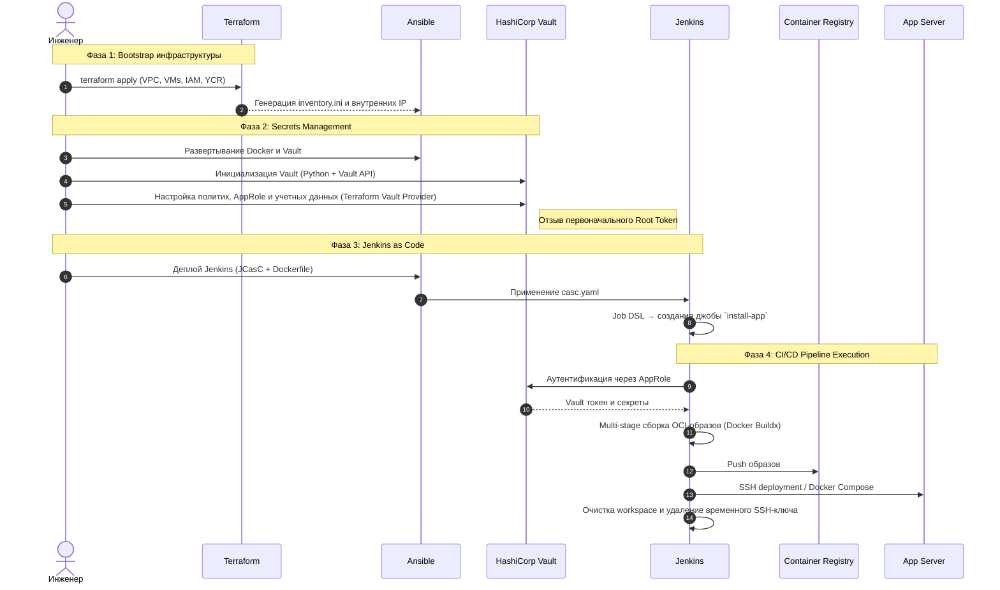

# Automated Cloud Infrastructure & CI/CD Pipeline


Демонстрационный проект автоматизированного развертывания облачной инфраструктуры и организации CI/CD в Yandex Cloud.

Система реализует подходы **Infrastructure as Code (IaC)** и **Configuration as Code (CaC)**: от создания сетевой инфраструктуры и вычислительных узлов до настройки сервисов, управления секретами и автоматической доставки Java-приложения.

## Содержание

* [О проекте](#о-проекте)
* [Архитектура системы](#архитектура-системы)

  * [Инфраструктурная топология](#инфраструктурная-топология)
  * [Сквозной процесс доставки](#сквозной-процесс-доставки)
* [Ключевые инженерные решения](#ключевые-инженерные-решения)

  * [Управление секретами и безопасность](#управление-секретами-и-безопасность)
  * [Infrastructure as Code и автоматизация](#infrastructure-as-code-и-автоматизация)
  * [CI/CD и Jenkins as Code](#cicd-и-jenkins-as-code)
* [Руководство по запуску](#руководство-по-запуску)

  * [Требования](#требования)
  * [Последовательность развертывания](#последовательность-развертывания)
  * [Подготовка облачной среды](#подготовка-облачной-среды)
  * [Подготовка окружения и секретов](#подготовка-окружения-и-секретов)

    * [Внедрение первичных секретов](#внедрение-первичных-секретов)
  * [Конфигурация проекта](#конфигурация-проекта)
  * [Развертывание платформы](#развертывание-платформы)

    * [Если что-то пошло не так с развёртыванием Vault или Jenkins](#если-что-то-пошло-не-так-с-развёртыванием-vault-или-jenkins)  
    * [Шаг 1: Облачная инфраструктура](#шаг-1-облачная-инфраструктура)
    * [Шаг 2: Базовая настройка узлов](#шаг-2-базовая-настройка-узлов)
    * [Шаг 3: Инициализация Vault](#шаг-3-инициализация-vault)
    * [Шаг 4: Настройка сервисной роли Terraform](#шаг-4-настройка-сервисной-роли-terraform)
    * [Шаг 5: Учетная запись администратора Vault](#шаг-5-учетная-запись-администратора-vault)
    * [Шаг 6: Декларативная настройка Vault](#шаг-6-декларативная-настройка-vault)
    * [Шаг 7: Учетная запись администратора Jenkins](#шаг-7-учетная-запись-администратора-jenkins)
    * [Шаг 8: Развертывание Jenkins](#шаг-8-развертывание-jenkins)
  * [Проверка работоспособности и запуск доставки](#проверка-работоспособности-и-запуск-доставки)
  * [Удаление инфраструктуры](#удаление-инфраструктуры)
* [Jenkinsfile](#jenkinsfile)
* [Roadmap](#roadmap)

## О проекте

Проект демонстрирует практическую реализацию:

* **Provisioning (IaC)** — управление ресурсами Yandex Cloud через Terraform: VPC, подсети, группы безопасности, виртуальные машины, Container Registry и сервисные учетные записи.
* **Configuration Management** — подготовка операционной системы на удалённых хостах, установка Docker и запуск базовых сервисов через модульные роли Ansible.
* **Secrets Management** — хранение и выдача секретов через HashiCorp Vault. Инициализация и настройка Vault автоматизированы с помощью Python, Bash и Terraform Vault Provider.
* **Jenkins as Code** — воспроизводимое развертывание Jenkins через JCasC и Job DSL с авторизацией в Vault по модели AppRole.
* **Delivery Pipeline** — multi-stage сборка Docker-образов, публикация в Yandex Container Registry и автоматический деплой на целевой сервер.

## Архитектура системы

### Инфраструктурная топология

Инфраструктура развернута в изолированной виртуальной сети **Yandex Cloud VPC** и разделена между управляющим узлом `ci-server` и целевым узлом `app-server`.



### Сквозной процесс доставки



## Ключевые инженерные решения

### Управление секретами и безопасность

* **Секреты не хранятся VCS:** чувствительные данные не хранятся в исходном коде и формируются динамически в процессе развертывания.
* **Жизненный цикл Vault Root Token:** первоначальный `root_token` Vault используется для создания сервисной роли Terraform AppRole, после чего отзывается автоматизированным скриптом.
* **Пароли хранятся только в виде хэшей:** учетные записи администраторов Vault и Jenkins создаются с предварительно вычисленными Bcrypt-хэшами. В конфигурационные файлы и Terraform state передаются только хэши (`password_hash_wo`).
* **Эфемерные SSH ключи:** Jenkins получает приватный SSH-ключ из Vault в память, записывает его во временный файл с правами `0400` только на время деплоя и удаляет его в `post { always }`.
* **Динамическая подстройка фаерволла:** внешний IP-адрес администратора определяется динамически через `data "http"` и используется для формирования правил Security Groups с маской `/32`.

### Infrastructure as Code и автоматизация

* **Модульная структура Terraform:** управление облачной инфраструктурой и конфигурацией Vault разделено между `terraform/infrastructure` и `terraform/vault`.
* **Автоматическая передача инфраструктурных параметров:** IP-адреса и другие выходные значения Terraform используются для генерации Ansible inventory и параметров ролей.
* **Lifecycle management для OCI-образов:** используется `yandex_container_repository_lifecycle_policy` для автоматической очистки устаревших и `untagged` образов.
* **Docker Buildx + Multi-stage сборка:** сборка выполняется через Docker Buildx с использованием подхода Docker-outside-of-Docker и необходимых CLI-плагинов.

### CI/CD и Jenkins as Code

Jenkins разворачивается без ручной конфигурации через UI:

* плагины устанавливаются на этапе сборки Docker-образа через `jenkins-plugin-cli`;
* системные настройки описываются в `casc.yaml` и применяются плагином JCasC (Jenkins Configuration as Code);
* джоба создается через Job DSL;
* интеграция с Vault использует AppRole;
* параметры джобы регистрируются при автоматическом холодном запуске сразу после создания джобы через Job DSL.

## Руководство по запуску

### **Важно:** все команды и скрипты необходимо выполнять из корневой директории проекта, если явно не указано иное.

### Требования
> **Для пользователей Windows:** запуск необходимо выполнять внутри **WSL2** либо внутри виртуальной машины с Ubuntu 22.04+.

> **Для пользователей из России и Беларуси:** для установки Terraform и Terraform CLI с официального сайта, а также для установки необходимых провайдеров через `terraform init` может потребоваться VPN для смены IP-адреса в связи с региональными ограничениями по IP на стороне HashiCorp.

Для запуска проекта необходимы:
* macOS / Linux с графическим интерфейсом (работоспособность проверена на `macOS 15.7.9` и `Ubuntu 22.04`)
* Terraform `>= 1.15.8`
* Ansible `>= 2.21.2` + коллекция `community.docker` (установка: `ansible-galaxy collection install community.docker`)
* Python `>= 3.14.6` + `python3-pip` + `python3-venv`
* Vault CLI `>= 2.0.3`
* Yandex Cloud CLI (`yc`)
* OpenSSH client
* Git
* Bash / zsh
* cURL
* Mozilla Firefox / Google Chrome актуальной версии

### Последовательность развертывания

```text
Terraform
   ↓
Yandex Cloud infrastructure
   ↓
Ansible
   ↓
Docker + Vault
   ↓
Vault bootstrap
   ↓
Terraform Vault Provider
   ↓
Jenkins JCasC + Job DSL
   ↓
Build application images
   ↓
Push to Yandex Container Registry
   ↓
SSH deployment
   ↓
Docker Compose
   ↓
Healthcheck
```

### Подготовка облачной среды

Для работы Terraform потребуется учётная запись в Yandex, настроенный профиль `yc` и сервисный аккаунт с ролью `admin` в целевом каталоге Yandex Cloud. 

#### 1. Установите Yandex Cloud CLI

Установите и настройте `yc` следуя инструкции из [официальной документации Yandex Cloud](https://yandex.cloud/ru/docs/cli/quickstart).

> ⚠️ **Важно:** Выполняйте инициализацию профиля `yc init` от имени вашего обычного пользователя. **Не используйте** `sudo` или пользователя `root`, иначе `yc` не сможет корректно взаимодействовать с браузером.

#### 2. Создайте сервисный аккаунт для Terraform

```bash
yc iam service-account create terraform-sa \
   --description "Service account for Terraform infrastructure management"
```

#### 3. Назначьте сервисному аккаунту роль

Подробнее: [документация Yandex Cloud IAM](https://yandex.cloud/ru/docs/iam/operations/sa/assign-role-for-sa)

```bash
yc resource-manager folder add-access-binding <YOUR_FOLDER_ID> \
   --role admin \
   --subject serviceAccount:<TERRAFORM_SA_ID>
```

#### 4. Создайте JSON-ключ

```bash
yc iam key create \
   --service-account-name terraform-sa \
   --output terraform-sa-key.json

# Файл потребуется на следующем этапе
# для размещения в директории secrets
```

### Подготовка окружения и секретов

#### 1. Клонируйте репозиторий и установите Python-зависимости

```bash
git clone https://github.com/h0ttab/devops-cloud-project.git

cd devops-cloud-project

# Создание и активация виртуального окружения Python, в которое будут установлены библиотеки, необходимые для дальнейших шагов
python3 -m venv venv
source venv/bin/activate

pip install -r scripts/python/requirements.txt
```

#### 2. Создайте структуру директории `secrets`

```bash
python3 scripts/python/init_secrets_dir_structure.py
```

Скрипт создает необходимую структуру автоматически. Если структура директорий успешно создана, в терминале вы увидите `Secrets directories structure generated successfully`.

#### 3. Добавьте зеркало Yandex для реестра провайдеров Terraform

Это необходимо для того, чтобы `terraform init` смог загрузить корректный провайдер для Yandex Cloud, т.к. в официальном реестре провайдеров Terraform провайдер Yandex Cloud более не поддерживается в виду региональных ограничений.

```bash
cat <<EOF > ~/.terraformrc
provider_installation {
  network_mirror {
    url = "https://terraform-mirror.yandexcloud.net/"
    include = ["registry.terraform.io/*/*"]
  }
  direct {
    exclude = ["registry.terraform.io/*/*"]
  }
}
EOF
```

### Внедрение первичных секретов

#### 1. Ключ сервисного аккаунта Terraform

Переместите созданный ранее JSON-ключ в `secrets/cloud/terraform-sa-key.json`

#### 2. SSH-ключ для CI/CD и доступа к хостам

Создайте пару `ed25519` без парольной фразы:

```bash
ssh-keygen -t ed25519 -f secrets/ssh/cloud_ssh_key -N ""
```

### Конфигурация проекта

Перед запуском задайте собственные параметры.

#### 1. Переменные Terraform

Отредактируйте `terraform/infrastructure/terraform.tfvars` под свои `cloud_id` и `folder_id`.

Например:

```hcl
cloud_id  = "<YOUR_YANDEX_CLOUD_ID>"
folder_id = "<YOUR_YANDEX_FOLDER_ID>"

repositories = ["shareit-server", "shareit-gateway"]
```

Переменная `repositories` содержит названия Docker-репозиториев, которые будут созданы в Yandex Container Registry (YCR). Для развёртывания демонстрационного приложения оставьте значение по умолчанию.

Репозитории создаются заранее, чтобы к ним можно было сразу привязать lifecycle policies.

> **Важно:** названия репозиториев должны совпадать с именами (не полными тегами, а только именами) Docker-образов приложений, которые будут загружаться в YCR.

#### 2. (Опционально) Git-репозиторий приложения

Для развертывания собственного приложения измените URL репозитория в `ansible/roles/jenkins/vars/main.yml`

```yaml
app_scm_url: "https://github.com/<YOUR_USERNAME>/<YOUR_APP>.git"
```

### Развертывание платформы

Развертывание выполняется строго в указанном порядке для соблюдения последовательности зависимостей между инфраструктурой, Vault и Jenkins.

#### Если что-то пошло не так с развёртыванием Vault или Jenkins

Каждый шаг для развёртывания платформы рассчитан на то, что все предыдущие шаги выполнены успешно и строго по порядку. Особенно к этому чувствительны скрипты для развёртывания и настройки Vault и Jenkins - если скрипт выполнился наполовину, а потом пропало соединение или произошла ошибка, то дальнейшие шаги могут выполняться некорректно или падать с ошибками.

Если вы столкнулись с подобной проблемой, то воспользуйтесь соответствующим скриптом, который сбросит сервис (Vault / Jenkins) до состояния чистой установки: 
   - останавливается и удаляется контейнер сервиса;
   - удаляются все сохранённые данные сервиса;
   - (только для Vault) автоматически запустится Ansible playbook, который развернёт новый контейнер Vault.

Для Vault:
```bash
bash ./scripts/bash/vault_reset.sh <CI_SERVER_PUBLIC_IP>
```
> После сброса Vault необходимо будет заново выполнить шаги 3-6 из раздела ["Развертывание платформы"](#шаг-3-инициализация-vault).

Для Jenkins:
```bash
bash ./scripts/bash/jenkins_reset.sh <CI_SERVER_PUBLIC_IP>
```
> После сброса Jenkins необходимо будет выполнить шаги 7-8 из раздела ["Развертывание платформы"](#шаг-7-учетная-запись-администратора-jenkins).

#### Шаг 1: Облачная инфраструктура

```bash
cd terraform/infrastructure

# При первом запуске дополнительно выполнить:
# terraform init

terraform apply -auto-approve

cd ../..
```

Будут созданы:

* подсеть и группы безопасности;
* Container Registry и репозитории;
* две виртуальные машины;
* сервисный аккаунт для работы с реестром;
* необходимые IAM-права и lifecycle policies;
* `ansible/inventory.ini`;
* `terraform/vault/terraform.tfvars`;
* `ansible/roles/jenkins/vars/ips.yml`.

#### Шаг 2: Базовая настройка узлов

```bash
cd ansible

ansible-playbook main.yaml

cd ..
```

На узлах устанавливается Docker и необходимые зависимости. На `ci-server` запускается sealed-контейнер HashiCorp Vault.

#### Шаг 3: Инициализация Vault

```bash
python3 scripts/python/vault_init.py <CI_SERVER_PUBLIC_IP>
```

Результат:

* Vault инициализирован;
* используется схема Шамира: `12 shares / 10 threshold`;
* ключи сохранены в `secrets/vault/vault_bootstrap_keys.json`;
* первоначальный `vault_root_token` сохранен локально;
* Vault приведен в состояние `unsealed`.

#### Шаг 4: Настройка сервисной роли Terraform

```bash
bash scripts/bash/vault_config_terraform.sh \
    <CI_SERVER_PUBLIC_IP> \
    <VAULT_PORT>
```

Порт Vault по умолчанию: `8200`.

В результате:

* создается AppRole `terraform`;
* назначается политика `terraform-admin`;
* учетные данные сохраняются в `secrets/vault/approle/terraform_approle.json`;
* первоначальный `root_token` отзывается.

#### Шаг 5: Учетная запись администратора Vault

```bash
python3 scripts/python/gen_vault_admin_userpass.py
```

Создается постоянная учетная запись администратора и генерируется Bcrypt-хэш пароля.

Результат сохраняется по пути `secrets/vault/vault_admin_credentials.json`

#### Шаг 6: Декларативная настройка Vault

```bash
cd terraform/vault

# При первом запуске дополнительно выполнить:
# terraform init

terraform apply -auto-approve

cd ../..
```

В Vault появляются:

* движок секретов KV v2;
* политика `jenkins`;
* AppRole `jenkins`;
* сгенерированные учетные данные для БД приложения;
* секреты с SSH-ключами;
* учетные данные `jenkins` AppRole.
* файл `secrets/vault/approle/jenkins_approle.json`

#### Шаг 7: Учетная запись администратора Jenkins

```bash
python3 scripts/python/gen_jenkins_creds.py
```

Файл `secrets/jenkins/credentials.json` содержит данные, необходимые Jenkins для работы:

* логин и Bcrypt-хэш пароля администратора;
* ID Yandex Container Registry;
* учетные данные AppRole для Vault.

#### Шаг 8: Развертывание Jenkins

```bash
cd ansible

ansible-playbook jenkins.yaml

cd ..
```

В результате:

* собирается кастомный Docker-образ Jenkins;
* устанавливаются необходимые плагины;
* применяется `casc.yaml` через плагин JCasC;
* настраиваются пользователи и интеграция с Vault;
* Job DSL создает задачу (job) `install-app`;

## Проверка работоспособности и запуск доставки

### 1. Доступ к интерфейсам

**HashiCorp Vault UI**

```text
http://<CI_SERVER_PUBLIC_IP>:8200
```

Аутентификация выполняется через выбор способа авторизации `Userpass` с учетными данными из шага 5.

**Jenkins UI**

```text
http://<CI_SERVER_PUBLIC_IP>:8080
```

Используются учетные данные из шага 7.

### 2. Запуск pipeline

1. Откройте Jenkins.
2. Выберите сборку `install-app`.
3. Нажмите **Build Now**.

При первом запуске сборки не будет возможности указать параметры (**Build with parameters**), т.к. список параметров прописан в Jenkinsfile, который находится в репозитории приложения, и на момент первого запуска сборки этот файл ещё не будет прочитан Jenkins. Первый запуск либо использует параметры по умолчанию, если они указаны в Jenkinsfile, либо сборка упадёт с ошибкой из-за того, что Jenkins не смог получить параметры.

Вне зависимости от результата выполнения первой сборки, сразу после её завершения кнопка **Build Now** поменяется уже на **Build with Parameters**, и параметры можно будет задать в интерфейсе Jenkins перед запуском новой сборки.

Во время выполнения Jenkins:

* получает секреты из Vault;
* собирает Docker-образы через Buildx;
* выполняет `docker login` в Yandex Container Registry;
* публикует образы;
* подключается к `app-server` по SSH с временным ключом;
* запускает приложение через Docker Compose.

### 3. Проверка приложения

Healthcheck API Gateway:

```text
http://<APP_SERVER_PUBLIC_IP>:8080/actuator/health
```

Можно открыть адрес через браузер или выполнить GET-запрос. Статус ответа HTTP `200` означает, что приложение успешно развернуто и отвечает на запросы.

## Удаление инфраструктуры

Перед удалением инфраструктуры необходимо вручную удалить Container Registry, так как непустой реестр нельзя удалить через Terraform стандартным способом.

Для этого выполните команду:

```bash
# Перед первым выполнением добавьте своему аккаунту роль "container-registry.registries.forceDeleter". User Account ID можно узнать командой `yc iam whoami`.

# yc container registry add-access-binding container-registry --role container-registry.registries.forceDeleter --subject userAccount:<USER_ACCOUNT_ID>

yc container registry force-delete container-registry
```

> Если по какой-то причине удалить реестр через команду не получится, то можно удалить его через [веб-консоль Yandex Cloud](https://console.yandex.cloud/).

После этого удалите инфраструктуру через Terraform:

```bash
cd terraform/infrastructure

terraform destroy -auto-approve
```

## Jenkinsfile

Jenkinsfile в этом репозитории приведен как часть демонстрационного CI/CD-контура. Технически он относится к конкретному приложению, а не к инфраструктурному коду.

В демонстрационном приложении [ShareIt](https://github.com/h0ttab/shareit) используется этот же Jenkinsfile.

## Roadmap

Дальнейшее развитие проекта предполагает следующие направления.

### Сетевая безопасность и PKI

* Private CA на базе **HashiCorp Vault PKI Secrets Engine**.
* Reverse Proxy на базе Nginx или Traefik.
* TLS/HTTPS для Jenkins, Vault и API Gateway.
* Автоматический выпуск и ротация сертификатов.

### Хранилище артефактов

* Развертывание локального **Sonatype Nexus**.
* Переход от Yandex Container Registry к собственному OCI реестру (Nexus).
* Адаптация CI/CD pipeline под работу с локальным реестру образов.

### Observability

* Prometheus + Grafana.
* `node-exporter` и `cAdvisor`.
* Fluent Bit для сбора логов.
* OpenSearch и OpenSearch Dashboards.
* Alertmanager для алертинга.

### Kubernetes и GitOps

* Миграция приложения с виртуальных машин на Kubernetes.
* Helm charts для сервисов.
* GitOps-подход с использованием Argo CD.