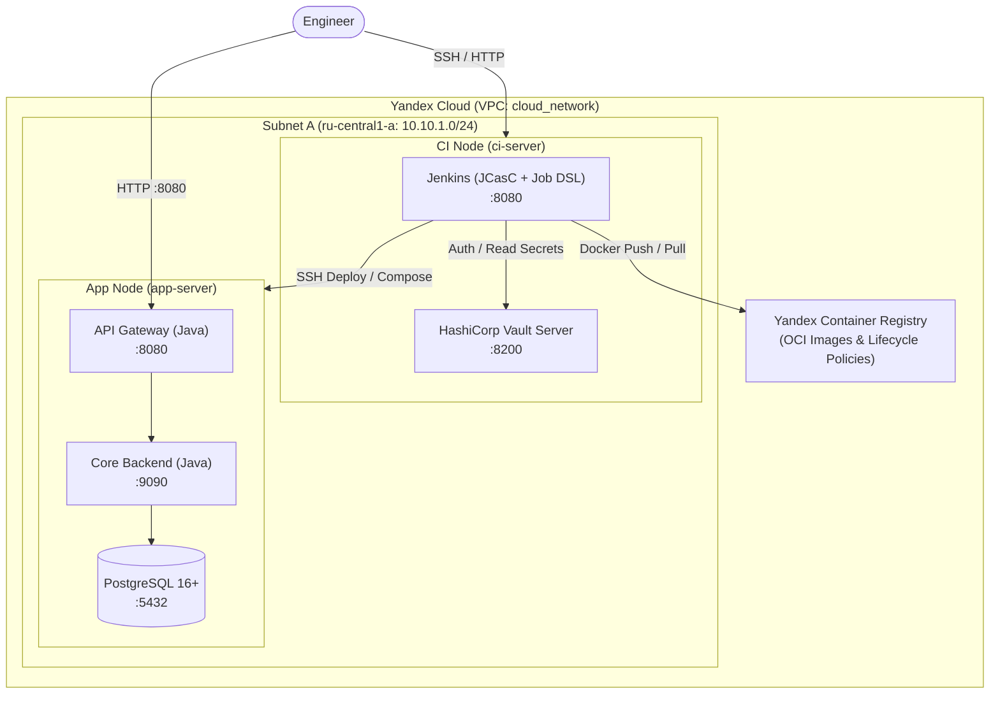
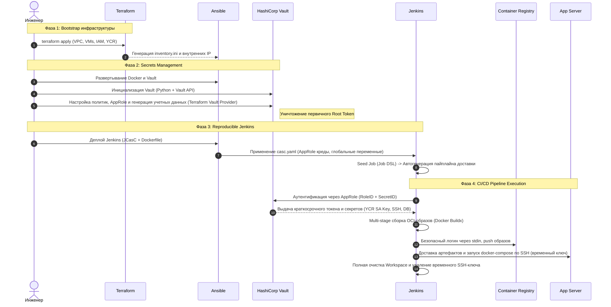

# Automated Cloud Infrastructure & CI/CD Pipeline


Сквозной проект автоматизированного развертывания облачной инфраструктуры и организации полного цикла доставки программного обеспечения (CI/CD) с нуля в среде **Yandex Cloud**. 

Система реализует подходы **Infrastructure as Code (IaC)** и **Configuration as Code (CaC)**: от создания сетевой связности и изолированных вычислительных узлов до конфигурации сервисов, безопасного управления динамическими секретами и автоматической доставки и деплоя микросервисного Java-приложения.

### Проект демонстрирует практическую реализацию:
* **Provisioning (IaC):** Декларативное управление облачными ресурсами (VPC, подсети, группы безопасности, виртуальные машины, Container Registry, сервисные учетные записи) с помощью **Terraform**.
* **Configuration Management:** Подготовка операционной системы, установка контейнерного рантайма и запуск базовых сервисов через модульные роли **Ansible**.
* **Secrets Management:** Безопасное хранение и дистрибуция учетных данных с использованием **HashiCorp Vault**. Полная автоматизация инициализации и распечатывания хранилища (Python/Bash) с управлением политиками через Terraform Vault Provider.
* **Reproducible Jenkins:** Развертывание полностью воспроизводимого экземпляра **Jenkins** через подход **JCasC (Jenkins Configuration as Code)** и **Job DSL** с интеграцией авторизации в Vault по модели **AppRole**.
* **Delivery Pipeline:** Автоматизированный процесс multi-stage сборки Docker-образов приложений, публикация в реестр артефактов и оркестрация деплоя на целевые хосты.

## Архитектура системы

### Инфраструктурная топология
Инфраструктура развернута в изолированной виртуальной сети **Yandex Cloud VPC** и разделена по зонам ответственности между управляющим узлом (`ci-node`) и целевым узлом развертывания приложения (`app-node`).



### Сквозной процесс доставки и модель безопасности



## Ключевые инженерные решения и особенности реализации

### 🔐 Управление секретами и безопасность
* **Zero Secrets in VCS:** Исходный код и Git-история полностью очищены от чувствительных данных. Все доступы формируются динамически на этапе развертывания (Day 0).
* **Жизненный цикл Root-токена:** Первичный `root_token` Vault используется исключительно для создания сервисной роли Terraform AppRole, после чего **немедленно отзывается** автоматизированным скриптом.
* **Хэширование на стороне клиента:** Учетные записи администраторов Vault и Jenkins создаются с предварительным вычислением Bcrypt-хэшей (`bcrypt/pwinput` на Python). В конфигурационные файлы и стейт передаются исключительно хэши (`password_hash_wo`).
* **Эфемерные SSH-ключи:** Jenkins получает приватный ключ доступа к серверам приложений в оперативной памяти из Vault, материализует его во временный файл с правами `0400` исключительно на время выполнения стадии деплоя и гарантированно уничтожает его в блоке `post { always }`.
* **Dynamic IP allowlisting in Security Groups:** Динамическое определение внешнего IP-адреса администратора (`data "http"`) для автоматического формирования белых списков Security Groups с маской `/32`. Такой подход позволяет разрешить доступ к облачным серверам только изнутри подсети, либо с внешнего IP-адреса администратора.

### ⚙️ Инфраструктура как код и автоматизация
* **Модульная структура Terraform:** Изоляция управления облачной инфраструктурой (`terraform/infrastructure`) и конфигурацией системы секретов (`terraform/vault`) с динамической выгрузкой выходных параметров, таких как IP-адреса серверов, которые автоматически сохраняются в инвентарь Ansible.
* **Автоматическое управление жизненным циклом образов:** Использование `yandex_container_repository_lifecycle_policy` для автоматической ротации и очистки untagged и устаревших OCI-образов (удержание последних стабильных версий).
* **Jenkins as Code (JCasC + Job DSL):** Полная независимость сервера непрерывной интеграции от ручных настроек через UI. Плагины "запекаются" в Docker-образ на этапе сборки (`jenkins-plugin-cli`), системные настройки применяются из декларативного YAML, а демонстрационная джоба создаётся программно через Job DSL с автоматической постановкой в очередь на "холодный запуск" для саморегистрации параметров (`queue`).
* **Docker Buildx + Multi-Stage builds:** Корректная сборка многокомпонентных приложений с multi-stage билдами за счет прямого проброса сокета Docker-демона и CLI-плагинов (`docker-compose-plugin`, `docker-buildx-plugin`) в контейнер с CI-агентом (подход Docker-outside-of-Docker).

## Руководство по запуску проекта

**ВАЖНО: *Все скрипты и консольные команды необходимо запускать из корневой директории проекта***

Для запуска проекта необходимо установить следующие инструменты:
* **Terraform** `>= 1.15.8`
* **Ansible** `>= 2.21.2`
* **Python** `>= 3.14.6` (с установленным пакетным менеджером `pip`)
* **Yandex Cloud CLI (`yc`)** ([Инструкция по установке утилиты, авторизации в аккаунте и настройке профиля](https://yandex.cloud/ru/docs/cli/quickstart))
* **OpenSSH client**
* **Git**
* **Bash**
* **Curl**

Если вы используете Windows, то проект необходимо запускать внутри **WSL2 (Ubuntu 22.04+)** или внутри **виртуальной машины с Ubuntu 22.04+**.

### Последовательность развёртывания проекта
---

Последовательность этапов развёртывания инфраструктуры и работы CI/CD пайплайна:

```text
Terraform
   ↓
Yandex Cloud infrastructure
   ↓
Ansible
   ↓
Docker + Vault
   ↓
Vault bootstrap
   ↓
Terraform Vault Provider
   ↓
Jenkins JCasC + Job DSL
   ↓
Build application images
   ↓
Push to Yandex Container Registry
   ↓
SSH deployment
   ↓
Docker Compose
   ↓
Healthcheck
```

### Подготовка облачной среды
---
Для управления ресурсами через Terraform потребуется настроенный профиль в `yc` *(Yandex Cloud CLI)* и сервисный аккаунт с правами редактора (`editor`) в целевом каталоге (folder) Yandex Cloud.

1. Создайте в Yandex Cloud сервисный аккаунт для Terraform

   ```bash
   yc iam service-account create terraform-sa \
      --description "Service account for Terraform infrastructure management"
   ```

2. Назначьте сервисному аккаунту роль на целевой каталог *(Подробнее в [документации Yandex Cloud IAM](https://yandex.cloud/ru/docs/iam/operations/sa/assign-role-for-sa))*
   
   ```bash
   yc resource-manager folder add-access-binding <YOUR_FOLDER_ID> \
      --role editor \
      --subject serviceAccount:<TERRAFORM_SA_ID>
   ```

3. Сгенерируйте JSON-ключ для работы от имени сервисного аккаунта

   ```bash
   yc iam key create \
      --service-account-name terraform-sa \
      --output terraform-sa-key.json
   # Этот файл потребуется на следующем этапе для размещения в директории secrets
   ```

### Подготовка окружения и секретов
---
На этом этапе подготавливаются локальные файлы конфигурации, генерируются SSH-ключи и формируется структура директории `secrets/`.

1. Склонируйте репозиторий и установите зависимости Python

   ```bash
   git clone https://github.com/h0ttab/devops-cloud-project.git
   cd devops-cloud-project

   pip install -r scripts/python/requirements.txt
   ```

2. Сгенерируйте необходимую структуру директории `secrets`

   ```bash
   # Скрипт создаст необходимую структуру автоматически
   # Скрипт необходимо запускать из корневой директории проекта
   python3 scripts/python/init_secrets_dir_structure.py
   ```

#### Внедрение первичных секретов

1. Ключ сервисного аккаунта Terraform

   Переместите сгенерированный ранее (п.3 раздела "Подготовка облачной среды") JSON-ключ для сервисного аккаунта в целевую директорию `secrets/cloud/terraform-sa-key.json`

2. SSH-ключи для работы CI/CD инструментов и прямого доступа к хостам

   Сгенерируйте публичный и приватный SSH-ключи типа `ed25519` без парольной фразы:
   ```bash
   # Команду необходимо выполнять из корневой директории проекта
   ssh-keygen -t ed25519 -f secrets/ssh/cloud_ssh_key -N ""
   ```

### Конфигурация проекта
---
Перед запуском определите собственные параметры в конфигурационных файлах:

1. Переменные для Terraform

   Обновите файл переменных для Terraform по пути `terraform/infrastructure/terraform.tfvars`:
   ```hcl
   cloud_id  = "<YOUR_YANDEX_CLOUD_ID>" # Ваш ID облака в Yandex Cloud
   folder_id = "<YOUR_YANDEX_FOLDER_ID>" # Ваш ID каталога в Yandex Cloud

   # Для демонстрационного проекта - оставить как есть, для иных случаев см. пояснение ниже
   repositories = [ "shareit-server", "shareit-gateway" ]
   ```
   В переменной `repositories` хранится массив названий Docker-репозиториев, которые будут созданы в Yandex Container Registry (YCR). При пуше образов в YCR репозитории создаются автоматически, но в нашем случае необходимо создать их заранее, чтобы сразу привязать к ним соответствующие политики жизненного цикла. 
   
   ***ВАЖНО: Название репозиториев должно совпадать с названиями (только имя образа, не весь тег) образов, которые будут размещаться в YCR.***

2. Git-репозиторий целевого приложения

   Если требуется развернуть собственный проект вместо демонстрационного ShareIt, измените URL целевого репозитория в файле `ansible/roles/jenkins/vars/main.yml`:
   ```yaml
   app_scm_url: "https://github.com/<YOUR_USERNAME>/<YOUR_APP>.git"
   ```

### Развертывание платформы
---

Развертывание необходимо выполнять строго в указанном порядке для соблюдения цепочки зависимостей секретов и конфигурации.

#### Шаг 1: Развертывание облачной инфраструктуры (Terraform)

Разворачиваем инфраструктуру
```bash
cd terraform/infrastructure
# При первом запуске также необходимо выполнить команду 
# terraform init
terraform apply -auto-approve
cd ../..
```
*Результат:* Созданы все объекты инфраструктуры в облаке: подсети, группы безопасности, реестр Docker контейнеров и два репозитория, две виртуальные машины, сервисный аккаунт для управления реестром контейнеров, настроены необходимые политики и права. Автоматически сгенерированы `ansible/inventory.ini`, `terraform/vault/terraform.tfvars` и `ansible/roles/jenkins/vars/ips.yml`.

#### Шаг 2: Базовая настройка узлов (Ansible)
Установка Docker, зависимостей и развертывание экземпляра HashiCorp Vault:
```bash
cd ansible
ansible-playbook main.yaml
cd ..
```
*Результат:* На всех узлах настроен Docker, на узле `ci-server` запущен запечатанный (sealed) контейнер HashiCorp Vault.

#### Шаг 3: Инициализация и снятие печати с Vault (Python)
Проводим инициализацию и распечатывание Vault:
```bash
# Получите внешний IP ci-server из inventory.ini или terraform output
python3 scripts/python/vault_init.py <CI_SERVER_PUBLIC_IP>
```
*Результат:* Vault инициализирован по схеме Шамира (12 shares / 10 threshold), ключи сохранены в `secrets/vault/vault_bootstrap_keys.json`, временный `vault_root_token` сохранен локально, с Vault снята печать (unsealed).

#### Шаг 4: Настройка сервисной роли Terraform в Vault (Bash)
Создание выделенной учётной записи типа AppRole для управления Vault через Terraform и **отзыв Root-токен**:
```bash
bash scripts/bash/vault_config_terraform.sh <CI_SERVER_PUBLIC_IP> <VAULT_PORT> # Порт по умолчанию 8200
```
*Результат:* Создан AppRole `terraform`, права назначены согласно политике `terraform-admin`, креды сохранены в `secrets/vault/approle/terraform_approle.json`, первичный `root_token` **безвозвратно отозван**.

#### Шаг 5: Генерация учетных данных администратора Vault (Python)
Установка логина и генерация Bcrypt-хэша пароля для постоянной учетной записи администратора:
```bash
python3 scripts/python/gen_vault_admin_userpass.py
```
*Результат:* Логин администратора и хэш пароля сохранен в `secrets/vault/vault_admin_credentials.json`.

#### Шаг 6: Декларативная настройка Vault (Terraform)
Применить конфигурацию через Terraform Vault Provider:
```bash
cd terraform/vault
# При первом запуске также необходимо выполнить команду 
# terraform init
terraform apply -auto-approve
cd ../..
```
*Результат:* Включен движок секретов KV-v2, настроена политика `jenkins`, создан AppRole `jenkins`, сгенерированы динамические учетные данные БД, загружены SSH-ключи и сгенерирован `secrets/vault/approle/jenkins_approle.json`.

#### Шаг 7: Генерация учетных данных администратора Jenkins (Python)
Установка логина и генерация Bcrypt-хэша пароля для постоянной учетной записи администратора, а также заполнение других секретов для работы Jenkins:
```bash
python3 scripts/python/gen_jenkins_creds.py
```
*Результат:* В `secrets/jenkins/credentials.json` агрегированы хэш пароля администратора, ID реестра YCR и креды AppRole для плагина Vault.

#### Шаг 8: Развертывание и конфигурация Jenkins (Ansible + JCasC)
Сборка кастомного образа Jenkins (с предустановленными плагинами) и применение конфигурации через JCasC:
```bash
cd ansible
ansible-playbook jenkins.yaml
cd ..
```
*Результат:* На узле `ci-server` собран образ Jenkins с предустановленными плагинами, применен `casc.yaml` (настроены пользователи, интеграция с Vault, глобальные переменные), а Job DSL создал пайплайн `install-app` и поставил его в очередь на "холодный прогон" для регистрации параметров из файла Jenkinsfile в репозитории приложения.


### Проверка работоспособности и запуск доставки
---

1. **Доступ к панелям управления:**
   * **HashiCorp Vault UI:** `http://<CI_SERVER_PUBLIC_IP>:8200` (Авторизация по методу `Userpass` с учетными данными из Шага 5).
   * **Jenkins UI:** `http://<CI_SERVER_PUBLIC_IP>:8080` (Авторизация с учетными данными из Шага 7).

2. **Запуск пайплайна доставки приложения:**
   * Перейдите в Jenkins -> выберите джобу **`install-app`**.
   * Нажмите **"Build with Parameters"** (в случае использования моего приложения ShareIt дефолтные параметры подтянутся автоматически).
   * Нажмите кнопку **"Build"**.
   * В процессе сборки Jenkins динамически запросит ключи из Vault, соберет Docker-образы (`buildx`), выполнит `docker login` в YCR, запушит образы, подключится по SSH к `app-server` с временным ключом и поднимет сервисы через Docker Compose.

3. **Проверка работы приложения:**
   * Healthcheck приложения доступен по адресу: `http://<APP_SERVER_PUBLIC_IP>:8080/actuator/health` (API Gateway приложения). Если ответ со статусом 200 - приложение успешно развёрнуто на целевом сервере.

### Удаление инфраструктуры
---
Для полного уничтожения всех созданных в облаке ресурсов:
```bash
# Сначала необходимо удалить Yandex Container Registry со всем содержимым
yc container registry force-delete container-registry

# После чего Terraform удалит всё остальное
cd terraform/infrastructure
terraform destroy -auto-approve
```
*Примечание: У Terraform ресурса Yandex Container Registry нет опции для автоматического удаления всех входящих в него репозиториев и образов (а если реестр не пустой, то удалить его нельзя), поэтому прямое ручное удаление - наиболее чистый и читаемый путь.*

### Jenkinsfile
---

Jenkinsfile в этом проекте приведён в качестве примера, так как технически он относится к приложению, а не к инфраструктуре. В демонстрационном приложении [ShareIt](https://github.com/h0ttab/shareit) используется именно этот Jenkinsfile.

## Roadmap

Текущая реализация представляет собой базовый фундамент платформы доставки. В рамках дальнейшей эволюции архитектуры запланированы следующие этапы:

* **Сетевая безопасность и PKI (TLS/HTTPS):**
  * Развертывание собственного внутреннего Удостоверяющего Центра (Private CA) на базе **HashiCorp Vault PKI Secrets Engine**.
  * Настройка Reverse Proxy (Nginx/Traefik) для организации единой точки входа (Edge Gateway) и автоматического выпуска/ротации локальных TLS-сертификатов для всех веб-интерфейсов (Jenkins, Vault, API Gateway).
* **Изоляция контура артефактов (Artifact Management):**
  * Развертывание и настройка локального репозитория **Sonatype Nexus** (Docker Hosted/Proxy Registry) для перехода на модель On-Premise / Air-gapped (отказ от использования управляемого Yandex Container Registry).
  * Адаптация CI/CD пайплайна под авторизацию и доставку OCI-образов в собственный защищенный Nexus.
* **Наблюдаемость и надежность (Observability Stack):**
  * **Сбор метрик:** Развертывание отдельного узла мониторинга (`obs-node`) с **Prometheus**, экспортерами системных метрик (`node-exporter`) и контейнеров (`cAdvisor`), визуализация в **Grafana**.
  * **Централизованное логирование:** Внедрение легковесных сборщиков **Fluent Bit** на рабочих узлах с отправкой и индексацией логов в **OpenSearch** (OpenSearch Dashboards).
  * **Алертинг:** Настройка пороговых правил оповещений через Alertmanager об исчерпании ресурсов хостов или падении контейнеров.
* **Оркестрация и GitOps (Next Level):**
  * Миграция целевого окружения с виртуальных машин на **Kubernetes**.
  * Упаковка сервисов в Helm-чарты и переход к концепции GitOps с использованием **ArgoCD**.